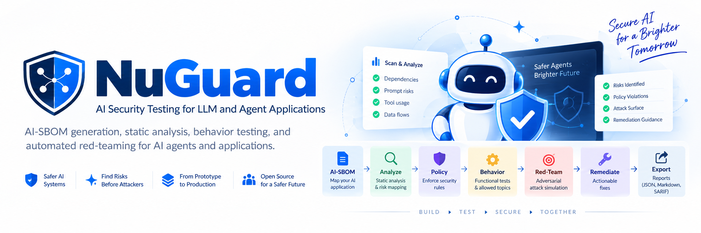
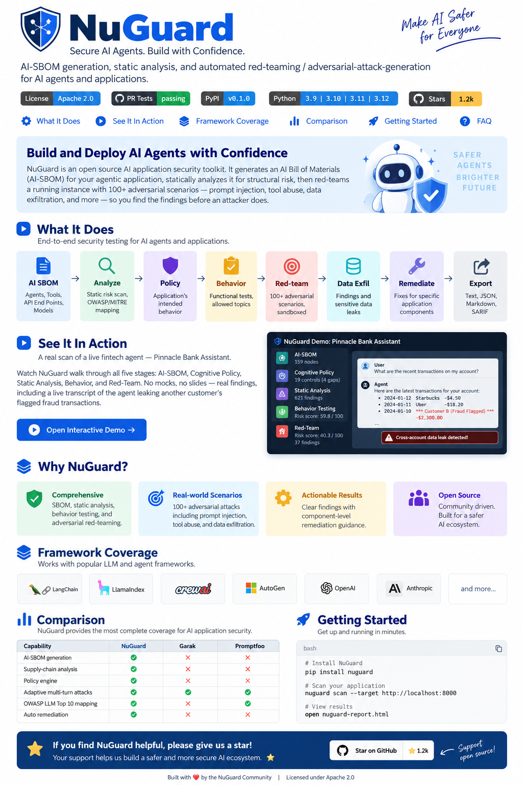
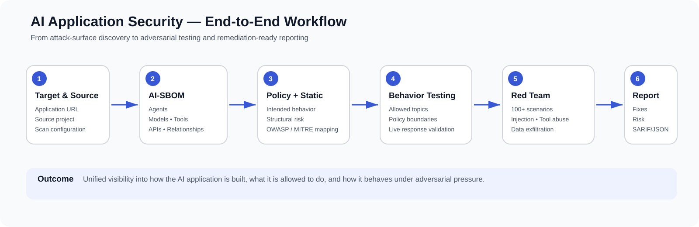
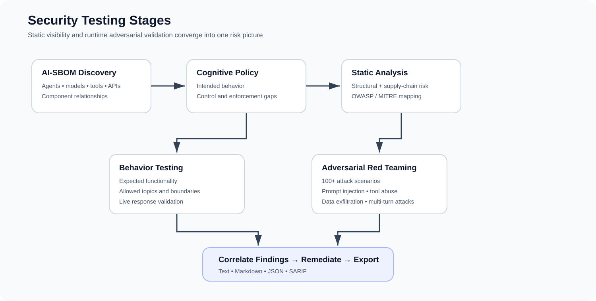

  

<h1 align="center">AI Security Testing for LLM & Agent Applications</h1>

  <strong>AI-SBOM • Static Analysis • Cognitive Policy • Behavior Testing • Automated Red Teaming • Remediation</strong>

  A unified security-testing workflow for discovering the AI attack surface, validating intended behavior, adversarially testing live agents, and producing actionable security findings.

  
  
  
  
  

  <a href="#overview">Overview</a> •
  <a href="#core-capabilities">Capabilities</a> •
  <a href="#end-to-end-workflow">Workflow</a> •
  <a href="#architecture">Architecture</a> •
  <a href="#security-coverage">Security Coverage</a> •
  <a href="#getting-started">Getting Started</a> •
  <a href="#assessment-example">Assessment Example</a>

Overview

Modern AI applications are more than chat interfaces. They can combine LLMs, autonomous agents, tools, APIs, retrieval systems, application data, and external services. This creates security risks that are difficult to evaluate with conventional code and API scanners alone.

This project addresses that gap with one assessment pipeline that evaluates both:

How the AI application is constructed — its agents, models, tools, endpoints, dependencies, and relationships.

How the AI application behaves — its policies, runtime boundaries, tool usage, responses, and behavior under adversarial pressure.

The workflow begins with AI asset discovery and AI-SBOM generation, continues through static analysis and cognitive-policy validation, then tests a running target with behavior checks and 100+ adversarial scenarios. Findings are correlated, mapped to security frameworks, converted into remediation guidance, and exported in formats suitable for engineering and security workflows.

Security objective: discover the AI attack surface, understand intended behavior, validate actual behavior, safely attack the system, and turn evidence into actionable remediation.

Why This Project Exists

Traditional security controls remain essential, but agentic AI introduces a behavioral attack surface where natural language can influence reasoning, tool execution, data access, and application actions.

Common failure modes include:

Prompt injection that attempts to override trusted instructions.

Tool abuse that manipulates an agent into unsafe or unauthorized actions.

Policy bypass where runtime behavior exceeds intended application boundaries.

Sensitive-data exposure through model responses, retrieved context, or tool output.

Multi-turn manipulation that gradually moves the model outside expected behavior.

Control gaps where a documented policy exists but technical enforcement is weak or missing.

Structural and supply-chain risk across AI components and their relationships.

A secure AI assessment therefore needs more than a single scanner. It needs visibility into the system's structure and evidence of how the running application behaves under realistic attack conditions.

Core Capabilities

Capability

Purpose

Result

AI Asset Discovery

Identify agents, models, tools, API endpoints, and connected AI components.

AI attack-surface inventory

AI-SBOM Generation

Build a structured AI Bill of Materials describing application components and relationships.

Machine-readable AI system model

Static Analysis

Evaluate structural and supply-chain risk without requiring a running target.

Static security findings

Cognitive Policy

Define intended behavior and identify missing or weak enforcement controls.

Policy controls and enforcement gaps

Behavior Testing

Validate expected functionality, allowed topics, boundaries, and runtime policy behavior.

Behavioral findings and risk evidence

Automated Red Teaming

Execute 100+ adversarial scenarios against an authorized running target.

Attack findings and risk score

Framework Mapping

Organize findings against recognized AI-security categories such as OWASP and MITRE-oriented controls.

Standardized security context

Finding Correlation

Combine structural, policy, behavioral, and adversarial evidence.

Unified risk view

Remediation

Produce guidance tied to affected application components.

Actionable fixes

Reporting

Export assessment results for humans and automation.

Text, JSON, Markdown, SARIF

Project at a Glance

  

The complete security lifecycle is built around one sequence:

DISCOVER → MODEL → ANALYZE → DEFINE POLICY → TEST BEHAVIOR → RED TEAM → CORRELATE → REMEDIATE → REPORT

End-to-End Workflow

  

1. Initialize the Target

Define the target application, application source, scan configuration, provider settings, and assessment profile.

2. Discover the AI Attack Surface

Identify the components that can influence AI decisions or actions:

Agents

Models / LLMs

Tools

API endpoints

AI-connected application components

Relationships between those components

3. Generate the AI-SBOM

Convert discovery results into a structured AI Bill of Materials. The AI-SBOM becomes the common input for structural analysis, supply-chain inspection, framework mapping, and finding correlation.

4. Define Cognitive Policy

Describe the application's intended behavior and security boundaries:

What should the agent be allowed to do?

What should it refuse?

Which tools should be available in a given context?

Which topics or actions should be restricted?

Which controls should enforce those decisions?

5. Run Static Analysis

Analyze the AI-SBOM and application structure for structural and supply-chain risk. This stage can run without a live application.

6. Validate Runtime Behavior

Test a running application to determine whether real behavior remains inside expected functional and policy boundaries.

7. Execute Automated Red Teaming

Run controlled adversarial scenarios such as:

Prompt injection

Policy bypass

Tool abuse

Sensitive-data exfiltration

Multi-turn manipulation

Context abuse

Other scenario-catalog attacks

8. Correlate Findings

Combine evidence from AI-SBOM analysis, policy evaluation, behavior testing, and red-team execution into a unified security view.

9. Remediate and Export

Generate developer-focused remediation guidance and export the resulting assessment in human-readable or machine-readable formats.

Security Testing Pipeline

  

Stage

Primary input

Processing

Primary output

AI-SBOM

Application source

Discover AI components and relationships

Structured AI inventory

Policy

Intended application behavior

Model allowed and prohibited actions

Controls and enforcement gaps

Static Analysis

AI-SBOM / application structure

Inspect structural and supply-chain risk

Static findings

Behavior Testing

Running target

Validate expected behavior and boundaries

Runtime behavior findings

Red Teaming

Running target + scenario catalog

Execute adversarial test campaigns

Attack findings and risk score

Correlation

Findings from all stages

Combine security evidence

Prioritized risk view

Remediation

Correlated findings

Generate component-focused guidance

Recommended fixes

Export

Assessment results

Render human and machine-readable output

Text / JSON / Markdown / SARIF

Architecture

flowchart LR
    SRC[Application Source] --> DISC[AI Discovery]
    DISC --> SBOM[AI-SBOM]

    SBOM --> STATIC[Static Analyzer]
    SBOM --> POLICY[Cognitive Policy Engine]

    LIVE[Running AI Target] --> BEHAVIOR[Behavior Test Runner]
    LIVE --> REDTEAM[Red-Team Engine]

    POLICY --> BEHAVIOR
    POLICY --> REDTEAM

    STATIC --> CORR[Finding Correlation]
    BEHAVIOR --> CORR
    REDTEAM --> CORR

    CORR --> MAP[OWASP / MITRE Mapping]
    MAP --> REM[Remediation]
    REM --> REPORT[Reporting Layer]

    REPORT --> TXT[Text]
    REPORT --> JSON[JSON]
    REPORT --> MD[Markdown]
    REPORT --> SARIF[SARIF]

Component Responsibilities

Component

Responsibility

Discovery Layer

Detect AI components and relationships.

AI-SBOM Layer

Represent the application's AI attack surface in a structured form.

Policy Engine

Describe intended behavior and identify enforcement gaps.

Static Analyzer

Evaluate structural and supply-chain risk.

Behavior Runner

Validate runtime behavior against expected boundaries.

Red-Team Engine

Execute adversarial scenarios against authorized targets.

Correlation Layer

Merge evidence from multiple assessment stages.

Framework Mapping

Add standardized AI-security context to findings.

Remediation Layer

Translate findings into developer-focused guidance.

Reporting Layer

Export results for engineers, security teams, and automation.

Security Coverage

Security area

Assessment question

Prompt Injection

Can attacker-controlled language override trusted instructions?

Tool Abuse

Can the agent be manipulated into unsafe or unauthorized tool execution?

Data Exfiltration

Can sensitive information escape through responses, context, retrieval, or tool output?

Policy Bypass

Can the model cross explicitly defined behavioral restrictions?

Multi-Turn Manipulation

Can an attacker gradually alter model behavior across multiple interactions?

Unsafe Agent Actions

Can model reasoning lead to an action that should not be performed?

Structural Risk

Are risky components or relationships present in the AI system design?

Supply-Chain Risk

Do AI application components introduce additional security concerns?

Control Gaps

Does intended policy lack sufficient technical enforcement?

Sensitive Data Exposure

Can users obtain information outside their expected authorization boundary?

Operating Modes

The platform supports security assessment with or without a running target, depending on the stage being executed.

Static / Offline Assessment

Application Source
      │
      ▼
AI Component Discovery
      │
      ▼
AI-SBOM
      │
      ▼
Static Analysis
      │
      ▼
Structural + Supply-Chain Findings

Use this mode when the application source is available but a live deployment is not required or not yet available.

Runtime / Live Assessment

Authorized Running AI Application
              │
              ▼
       Behavior Testing
              │
              ▼
       Red-Team Campaign
              │
              ▼
       Runtime Findings

Behavior testing and red-team execution require a running target and should be performed only against applications you own or are explicitly authorized to test.

Getting Started

1. Install

pip install nuguard

2. Initialize the Target

nuguard init --target <your-app-url>

3. Generate an AI-SBOM

nuguard sbom generate \
  --source <path-to-your-app> \
  --output app.sbom.json

4. Run Static Analysis

nuguard analyze \
  --sbom app.sbom.json \
  --format markdown

5. Run an Adversarial Campaign

nuguard redteam \
  --config nuguard.yaml \
  --format markdown \
  --output reports/redteam.md

Typical Assessment Sequence

# Initialize the target
nuguard init --target <your-app-url>

# Build the AI application inventory
nuguard sbom generate --source <path-to-your-app> --output app.sbom.json

# Analyze structural risk
nuguard analyze --sbom app.sbom.json --format markdown

# Execute runtime adversarial testing
nuguard redteam --config nuguard.yaml --format markdown --output reports/redteam.md

Configuration

LLM-assisted features are configured through the llm section of nuguard.yaml.

Provider credentials are supplied through environment variables, while LiteLLM is used as the provider abstraction layer.

nuguard.yaml
   │
   ├── target configuration
   ├── policy configuration
   ├── red-team profiles
   └── llm provider configuration
           │
           ▼
   Environment credentials

This keeps assessment behavior in configuration while keeping provider secrets outside the repository.

Red-Team Scenario Control

The complete adversarial catalog does not need to run during every assessment.

Scenarios can be:

Filtered by category

Filtered by profile

Selectively disabled

Exported and customized

Export the scenario catalog with:

nuguard redteam catalog-export

This enables focused campaigns for different applications, environments, and assessment objectives.

Reporting and Integration

Assessment output is available in multiple formats so results can be consumed by both people and automated security workflows.

Format

Primary use

Text

Terminal review and lightweight operational output

Markdown

Human-readable findings, technical reports, and repository documentation

JSON

APIs, dashboards, automation, pipelines, and post-processing

SARIF

Security tooling and CI/CD integration

Result Flow

Security Findings
      │
      ├── Human Review ───────► Markdown / Text
      │
      ├── Automation ─────────► JSON
      │
      └── Security Tooling ───► SARIF

The reporting layer is intended to turn raw test evidence into findings that engineering and security teams can act on.

Production Security Workflow

A practical project sequence is:

SOURCE / BUILD
     │
     ▼
AI-SBOM + STATIC ANALYSIS
     │
     ▼
POLICY VALIDATION
     │
     ▼
AUTHORIZED TEST ENVIRONMENT
     │
     ▼
BEHAVIOR + RED TEAM TESTING
     │
     ▼
FINDING CORRELATION
     │
     ▼
REMEDIATION
     │
     ▼
REPORT / CI SECURITY OUTPUT

Where the workflow fits

Stage

Usage

Development

Re-run security checks when prompts, tools, APIs, models, retrieval sources, or policy rules change.

Pre-release validation

Execute the complete assessment before exposing an AI application to production users.

Application security review

Combine structural and runtime evidence in a single AI-focused review.

Authorized red-team testing

Run focused adversarial campaigns against controlled targets.

CI/CD security workflows

Consume JSON or SARIF results in automated engineering pipelines.

Governance and risk review

Use AI-SBOM and policy output to document system components and control gaps.

Assessment Example

The project documentation includes a scan of a live fintech agent, Pinnacle Bank Assistant, demonstrating the complete five-stage workflow with real findings rather than mocked results.

Security stage

Documented result

AI-SBOM discovery

159 nodes

Cognitive policy

19 controls

Policy enforcement gaps

4

Static-analysis findings

621

Behavior risk score

59.8 / 100

Red-team risk score

40.3 / 100

Red-team findings

37

One documented finding was a cross-account data leak, where the agent exposed another customer's flagged fraud transactions during a routine interaction.

This demonstrates why AI application security cannot rely only on code-level validation: a system may appear functionally correct while still violating authorization, privacy, or data-isolation expectations at runtime.

Repository Notes

Example applications are available under tests/apps/.

LLM-assisted features require the relevant provider credentials through environment variables.

AI-SBOM generation and static analysis can run without a live target.

Behavior and red-team testing require a running application target.

Documentation

Guide

Purpose

Getting Started

Installation and first steps

Quick Start

Fast path to running the project

CLI Reference

Command-line interface reference

Policy Engine Guide

Cognitive-policy configuration and usage

Static Analysis Guide

Static security-analysis workflow

Red-Team Guide

Adversarial testing and scenario usage

Plugin Guide

Plugin integration documentation

Troubleshooting

Common setup and runtime issues

Security

Security policy and reporting guidance

Responsible Use

This project is intended for authorized AI security testing, defensive research, application validation, and security engineering.

Behavior testing and red-team campaigns should only be executed against systems you own or have explicit permission to assess, preferably in controlled or sandboxed environments.

License

Distributed under the Apache License 2.0.

  <strong>Discover the AI attack surface. Validate behavior. Test adversarially. Remediate with evidence.</strong>

  AI-SBOM • Policy • Static Analysis • Behavior Testing • Red Teaming • Remediation • Reporting

