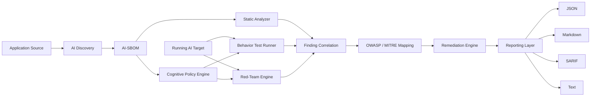

<p align="center">
  
</p>

<h1 align="center">AI Security Testing for LLM & Agent Applications</h1>

<p align="center">
  <strong>AI-SBOM • Static Analysis • Cognitive Policy • Behavior Testing • Automated Red Teaming • Remediation</strong>
</p>

<p align="center">
  A security engineering project for discovering, analyzing, and adversarially testing modern LLM applications and autonomous AI agents before they reach production.
</p>

<p align="center">
  
  
  
  
  
</p>

<p align="center">
  <a href="#-project-overview">Overview</a> •
  <a href="#-why-this-project-exists">Problem</a> •
  <a href="#-end-to-end-security-workflow">Workflow</a> •
  <a href="#-security-capabilities">Capabilities</a> •
  <a href="#-high-level-architecture">Architecture</a> •
  <a href="#-real-assessment-example">Demo</a> •
  <a href="#-getting-started">Getting Started</a> •
  <a href="#-star-interview-strategy">STAR Strategy</a>
</p>

---

## 🚀 Project Overview

Modern AI applications are no longer isolated chat interfaces. They can use **LLMs, tools, APIs, retrieval systems, external services, application data, and autonomous agent workflows**. That creates a security problem traditional scanners do not fully address: an application can be structurally valid while still behaving unsafely when manipulated through natural language.

This project provides an end-to-end security workflow that combines **structural inspection** and **runtime adversarial testing**.

> **Core idea:** understand what the AI system is made of, define what it is supposed to do, test what it actually does, attack it safely, and turn the results into actionable remediation.

### What the platform evaluates

| Layer | Security objective |
|---|---|
| 🧩 **AI Asset Discovery** | Identify agents, models, tools, API endpoints, and connected AI components. |
| 📦 **AI-SBOM** | Build an AI Bill of Materials representing the AI attack surface. |
| 🔍 **Static Analysis** | Detect structural, configuration, and supply-chain risk without requiring a live target. |
| 🛡️ **Cognitive Policy** | Define intended application behavior and identify missing or weak enforcement controls. |
| 🧪 **Behavior Testing** | Validate allowed topics, expected responses, boundaries, and runtime policy behavior. |
| 🎯 **Red Teaming** | Execute 100+ adversarial scenarios covering prompt injection, tool abuse, data exfiltration, multi-turn manipulation, and more. |
| 🔗 **Framework Mapping** | Map findings to recognized AI-security categories such as OWASP and MITRE-oriented controls. |
| 🛠️ **Remediation** | Provide component-focused guidance for discovered weaknesses. |
| 📄 **Reporting** | Export findings in Text, JSON, Markdown, and SARIF formats. |

---

## 🖼️ Project at a Glance

<p align="center">
  
</p>

The visual above summarizes the complete product story: discover the AI application, analyze its structure, validate policy and behavior, launch adversarial tests, identify data leakage or control failures, remediate the affected component, and export results for engineering or security workflows.

---

## 🎯 Why This Project Exists

Traditional security tooling is excellent at finding many code, dependency, API, and infrastructure weaknesses. Agentic AI introduces additional risks because **language becomes an attack interface** and models can influence real actions.

### The security gap

- A user can attempt to override system instructions through **prompt injection**.
- An agent may call tools or APIs with permissions that exceed what the user should control.
- Multi-turn conversations can gradually move a model outside its expected policy boundaries.
- Sensitive information can leak through model responses, retrieved context, or tool outputs.
- A correct-looking codebase does not guarantee safe runtime behavior.
- Security decisions depend on **prompts, model behavior, policies, tools, context, data flow, and orchestration**.

### The solution

This project treats AI security as a continuous lifecycle rather than a single scanner:

```text
DISCOVER → MODEL → ANALYZE → DEFINE POLICY → TEST BEHAVIOR → ATTACK → CORRELATE → REMEDIATE → REPORT
```

That gives teams visibility into both:

1. **How the AI application is constructed**
2. **How the AI application behaves under adversarial pressure**

---

## 🔄 End-to-End Security Workflow

<p align="center">
  
</p>

### Stage 01 — Target Initialization

Configure the application source, target URL, scan settings, provider configuration, and security profile required for the assessment.

### Stage 02 — AI Attack-Surface Discovery

Identify the parts of the application that can influence AI decisions or actions:

- Agents
- Models / LLMs
- Tools
- API endpoints
- AI-connected application components
- Relationships between those components

### Stage 03 — AI-SBOM Generation

Build a structured inventory of the AI system. The AI-SBOM becomes the common foundation for static analysis, supply-chain inspection, security mapping, and later correlation.

### Stage 04 — Cognitive Policy

Describe the application's **intended behavior**:

- What is the agent allowed to do?
- What must it refuse?
- Which tools should be available in each context?
- Which topics or actions should be restricted?
- Which controls should enforce those decisions?

### Stage 05 — Static Security Analysis

Analyze the AI-SBOM and application structure to identify structural or supply-chain risk before runtime testing begins.

### Stage 06 — Behavioral Validation

Interact with a running target and validate that real behavior matches policy expectations.

### Stage 07 — Automated Red Teaming

Execute **100+ adversarial scenarios** in a controlled environment, including attacks such as:

- Prompt injection
- Policy bypass
- Tool abuse
- Sensitive-data exfiltration
- Multi-turn manipulation
- Context abuse
- Other scenario-catalog attacks

### Stage 08 — Finding Correlation

Bring structural, policy, behavior, and red-team findings together so a security team can understand the complete risk rather than isolated scanner output.

### Stage 09 — Remediation & Reporting

Generate human-readable and machine-readable results that can be used by developers, AppSec teams, red teams, auditors, or CI/CD pipelines.

---

## 🧪 Security Testing Workflow

<p align="center">
  
</p>

| Phase | Input | What happens | Output |
|---|---|---|---|
| **AI-SBOM** | Source / project | Discover AI components and relationships | Structured AI inventory |
| **Policy** | Intended behavior | Model allowed and prohibited actions | Policy controls and gaps |
| **Static Analysis** | AI-SBOM / structure | Inspect structural and supply-chain risk | Static findings |
| **Behavior Testing** | Running target | Validate expected behavior and boundaries | Behavioral findings |
| **Red Teaming** | Running target + scenario catalog | Launch adversarial test campaigns | Attack findings and risk score |
| **Correlation** | Findings from all stages | Combine evidence into a unified risk view | Prioritized security issues |
| **Remediation** | Correlated findings | Produce component-specific guidance | Fix recommendations |
| **Export** | Assessment results | Render reports for people and automation | Text / JSON / Markdown / SARIF |

---

## 🛡️ Security Capabilities

### AI-SBOM & Attack-Surface Visibility

Instead of treating an AI application as one opaque chatbot, the project models the components that participate in decisions and actions. This creates the visibility required to reason about risk across the entire AI workflow.

### Cognitive Policy Validation

Security is evaluated against the application's intended behavior. This allows the system to distinguish between normal functionality and behavior that crosses a defined security boundary.

### Static AI Security Analysis

Static analysis can produce useful findings even when the live application is unavailable. It focuses on structural and supply-chain risk derived from the application's AI components and relationships.

### Runtime Behavior Testing

Behavior testing checks whether a deployed or sandboxed application stays inside expected functional and topic boundaries when real requests are sent to it.

### Automated Adversarial Testing

The red-team engine supports a large catalog of attack scenarios and can filter campaigns by category or profile instead of requiring every scenario to run every time.

### Actionable Security Reporting

Reports can be produced for both engineers and automation workflows, including SARIF for security tooling and CI/CD integration.

---

## ⚔️ Threat Coverage

| Threat | What the assessment asks |
|---|---|
| **Prompt Injection** | Can attacker-controlled language override trusted instructions? |
| **Tool Abuse** | Can an agent be manipulated into unsafe or unauthorized tool execution? |
| **Data Exfiltration** | Can sensitive information escape through responses, context, or tool outputs? |
| **Policy Bypass** | Can the model cross explicitly defined behavioral restrictions? |
| **Multi-Turn Manipulation** | Can an attacker gradually change model behavior across multiple interactions? |
| **Unsafe Agent Actions** | Can model reasoning lead to an action that should not be performed? |
| **Structural Risk** | Are risky components or relationships visible in the AI system design? |
| **Supply-Chain Risk** | Do components used by the AI application introduce security concerns? |
| **Control Gaps** | Does the intended policy lack sufficient technical enforcement? |
| **Sensitive Data Exposure** | Can a user retrieve information outside their expected authorization boundary? |

---

## 🏗️ High-Level Architecture



### Architecture responsibilities

| Component | Responsibility |
|---|---|
| **Discovery Layer** | Detect AI components and relationships. |
| **AI-SBOM Layer** | Represent the application attack surface in a structured form. |
| **Policy Engine** | Describe intended behavior and identify enforcement gaps. |
| **Static Analyzer** | Evaluate structural and supply-chain risk. |
| **Behavior Runner** | Validate real runtime behavior against expected boundaries. |
| **Red-Team Engine** | Execute adversarial scenarios against authorized targets. |
| **Correlation Layer** | Merge evidence from multiple analysis stages. |
| **Framework Mapping** | Organize findings using recognized AI-security categories. |
| **Remediation Layer** | Convert findings into developer-focused fixes. |
| **Reporting Layer** | Export results for people, security tools, and automation. |

---

## 📊 Real Assessment Example

The project documentation includes a real assessment of a live fintech agent, **Pinnacle Bank Assistant**, demonstrating the complete workflow instead of a mocked scan.

<div align="center">

| Security stage | Documented result |
|---|---:|
| AI-SBOM discovery | **159 nodes** |
| Cognitive policy | **19 controls** |
| Policy enforcement gaps | **4** |
| Static-analysis findings | **621** |
| Behavior risk score | **59.8 / 100** |
| Red-team risk score | **40.3 / 100** |
| Red-team findings | **37** |

</div>

One demonstrated finding was a **cross-account data leak**, where the agent exposed another customer's flagged fraud transactions during a routine interaction.

> **Why this matters:** an AI application can appear functionally correct while still violating authorization, privacy, or data-isolation expectations at the behavioral layer.

---

## 💼 Where This Fits in a Real Security Program

### Before Production

Use the complete pipeline as a security gate before releasing an AI agent or LLM-enabled application.

### During Development

Re-run targeted tests when teams modify:

- System prompts
- Agent instructions
- Tool permissions
- API integrations
- Retrieval sources
- LLM providers or models
- Policy rules
- Business workflows

### AppSec / Product Security

Use AI-SBOM, static analysis, behavior testing, and red-team results as one assessment workflow for internal AI systems.

### Red Team / AI Security Assessment

Run focused adversarial campaigns against authorized applications and use correlation to turn attack observations into prioritized findings.

### CI/CD

Use JSON or SARIF output to connect AI-security validation with automated engineering workflows.

### Governance & Risk

Use AI-SBOM and policy information to document what the system contains, what it is intended to do, and where control gaps exist.

---

## ⚙️ Running With or Without a Live Target

### Static / Offline Mode

```text
Application Source
      │
      ▼
AI Component Discovery
      │
      ▼
AI-SBOM
      │
      ▼
Static Analysis
      │
      ▼
Structural + Supply-Chain Findings
```

A live application is not required for AI-SBOM generation and static analysis.

### Runtime / Live Mode

```text
Authorized Running AI Application
              │
              ▼
       Behavior Testing
              │
              ▼
       Red-Team Campaign
              │
              ▼
      Runtime Findings
```

Behavior and adversarial testing require a running target and should be performed only against systems you are authorized to test, preferably in a controlled or sandboxed environment.

---

## 🚀 Getting Started

### 1. Install

```bash
pip install nuguard
```

### 2. Initialize a target

```bash
nuguard init --target <your-app-url>
```

### 3. Generate an AI-SBOM

```bash
nuguard sbom generate \
  --source <path-to-your-app> \
  --output app.sbom.json
```

### 4. Run static analysis

```bash
nuguard analyze \
  --sbom app.sbom.json \
  --format markdown
```

### 5. Run an adversarial red-team campaign

```bash
nuguard redteam \
  --config nuguard.yaml \
  --format markdown \
  --output reports/redteam.md
```

---

## 🤖 LLM Provider Configuration

LLM-assisted features are configured through the `llm` section of `nuguard.yaml`.

Provider credentials are supplied through environment variables, while **LiteLLM** is used as the abstraction layer for LLM providers.

```text
nuguard.yaml
   │
   ├── target configuration
   ├── policy configuration
   ├── red-team profiles
   └── llm provider configuration
           │
           ▼
   Environment credentials
```

---

## 🎛️ Red-Team Scenario Control

A full red-team catalog does not need to run during every assessment.

Scenarios can be:

- Filtered by **category**
- Filtered by **profile**
- Selectively disabled
- Exported and customized

Export the scenario catalog with:

```bash
nuguard redteam catalog-export
```

This makes it possible to create focused campaigns for different applications, risk levels, environments, or assessment objectives.

---

## 📄 Reporting & Outputs

| Format | Best use |
|---|---|
| **Text** | Fast terminal review and simple operational output |
| **Markdown** | Human-readable security reports and GitHub documentation |
| **JSON** | APIs, automation, pipelines, dashboards, and post-processing |
| **SARIF** | Security tooling and CI/CD integration |

The reporting stage is designed to move beyond raw attack transcripts and provide findings that can be used by engineering and security teams.

---

## ⭐ STAR Interview Strategy

Use this section when explaining the project in a technical interview. Keep first-person claims limited to the parts you personally implemented, modified, integrated, or validated.

### **S — Situation**

Modern AI agents can connect LLMs to tools, APIs, retrieval systems, and sensitive business data. Traditional security scanners can inspect source code, dependencies, or APIs, but they do not fully test whether an AI system can be manipulated through prompts, multi-turn conversations, unsafe tool usage, or model-driven decisions.

### **T — Task**

The project needed a repeatable security workflow that could answer two important questions:

1. **What AI components and structural risks exist inside the application?**
2. **Can the running AI application be manipulated into unsafe behavior?**

### **A — Action**

The solution combines multiple security stages:

- Discover agents, models, tools, and APIs
- Generate an AI-SBOM
- Define and evaluate cognitive policy
- Run static structural and supply-chain analysis
- Map findings to AI-security frameworks
- Execute behavior validation against a live target
- Run 100+ adversarial scenarios
- Test prompt injection, tool abuse, policy bypass, multi-turn attacks, and data exfiltration
- Correlate findings across stages
- Export remediation-oriented results as Markdown, JSON, SARIF, or text

### **R — Result**

The result is a single workflow that evaluates both **how an AI application is built** and **how it behaves under attack**. In the documented fintech assessment, the pipeline identified a large AI component graph, policy gaps, hundreds of static findings, runtime red-team issues, and a cross-account data leak.

<details>
<summary><strong>🎤 45-second interview answer</strong></summary>

<br>

> “This project is an AI application security testing platform for LLM and agentic systems. The main security problem is that traditional scanners can inspect code and APIs, but they do not fully validate AI behavior. The workflow discovers the application's models, agents, tools, and API endpoints and generates an AI-SBOM. It then performs static risk analysis and evaluates the intended cognitive policy. For a live target, it runs behavioral tests and more than 100 adversarial scenarios covering prompt injection, tool abuse, policy bypass, multi-turn manipulation, and data exfiltration. Finally, it correlates findings and exports remediation-focused reports in formats such as Markdown, JSON, and SARIF. The key value is that it combines structural AI security visibility with runtime behavioral validation.”

</details>

---

## 📁 Repository Notes

- Example applications are available under `tests/apps/`.
- LLM-assisted features require the relevant provider credentials through environment variables.
- AI-SBOM and static-analysis workflows can run without a live target.
- Behavior and red-team testing require a running application target.

---

## 📚 Documentation

| Guide | Purpose |
|---|---|
| [Getting Started](documentation/docs/getting-started.md) | Installation and first steps |
| [Quick Start](documentation/docs/quick-start.md) | Fast path to running the project |
| [CLI Reference](documentation/docs/cli-reference.md) | Command-line interface reference |
| [Policy Engine Guide](documentation/docs/policy-engine-guide.md) | Cognitive-policy configuration and usage |
| [Static Analysis Guide](documentation/docs/static-analysis-guide.md) | Static security-analysis workflow |
| [Red-Team Guide](documentation/docs/redteam-guide.md) | Adversarial testing and scenario usage |
| [Plugin Guide](documentation/docs/plugin-guide.md) | Plugin integration documentation |
| [Troubleshooting](documentation/docs/troubleshooting.md) | Common setup and runtime issues |
| [Security](.github/SECURITY.md) | Security policy and reporting guidance |

---

## 🔐 Responsible Use

This project is intended for **authorized AI security testing, defensive research, application validation, and security engineering**. Run behavior and red-team campaigns only against systems you own or have explicit permission to assess.

---

## 📜 License

Distributed under the [Apache License 2.0](LICENSE).

---

<p align="center">
  <strong>Build AI systems that are not only intelligent — but observable, testable, and defensible.</strong>
</p>

<p align="center">
  <sub>AI-SBOM • Policy • Static Analysis • Behavior Testing • Red Teaming • Remediation</sub>
</p>
